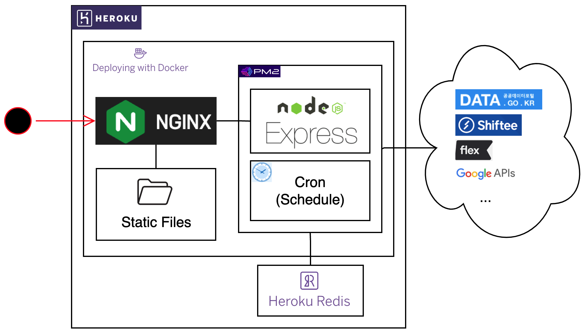

# kschoi service

## Build & Launch

```bash
# install dependencies
$ npm i

# launch server
$ npm start
```

## Deploy

Download and install the [Heroku CLI](https://devcenter.heroku.com/articles/heroku-cli)

If you haven't already, log in to your Heroku account and follow the prompts to create a new SSH public key.

```
$ heroku login
```

Log in to Container Registry
You must have Docker set up locally to continue. You should see output when you run this command.

```
$ docker ps
```

Now you can sign into Container Registry.

```
$ heroku container:login
```

Push your Docker-based app
Build the Dockerfile in the current directory and push the Docker image.

```
$ heroku container:push web --app kschoi
```

Deploy the changes
Release the newly pushed images to deploy your app.

```
$ heroku container:release web --app kschoi
```

## Architecture

